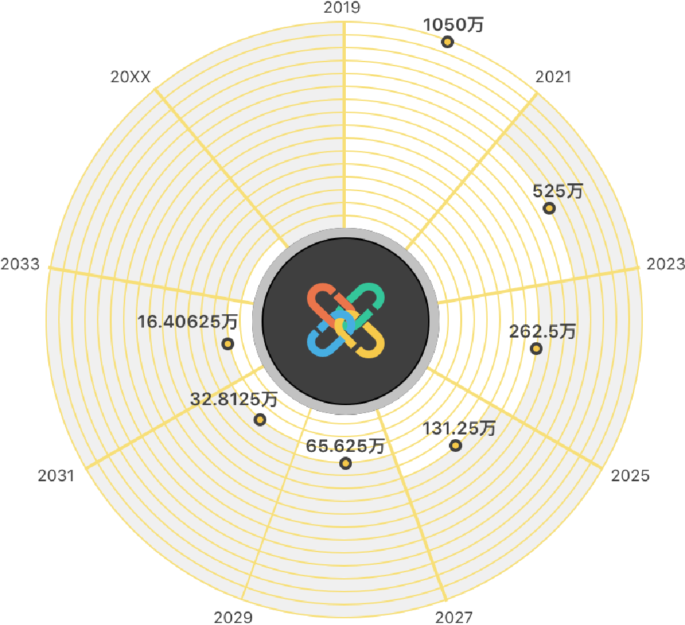
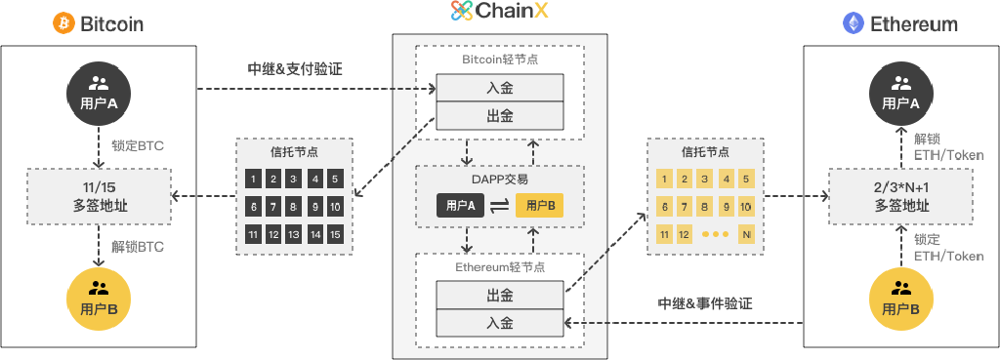
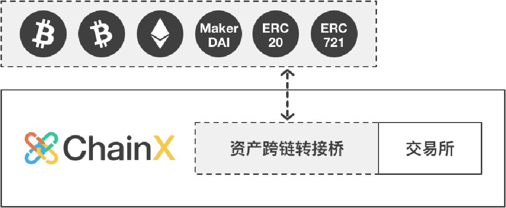
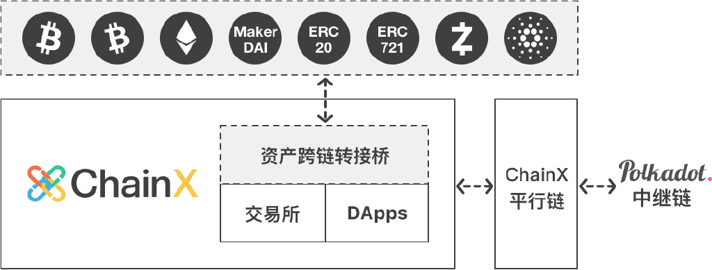

<h1 align="center">BNStock 白皮书</h1>

2023-12-12

数字资产跨链与社交的融合平台

打破链间资产壁垒，实现多链资产融合，为去中心化社交赋能

## 背景

随着Ordinals的火爆，BTC生态也随之壮大，既有以BRC20等代币为代表的链上数据流，也有以闪电网络、Stacks等为代表的链下数据流。许多团队已经开始探索如何在比特币网络上复制 DeFi 和 NFT 等基础设施。但由于缺乏智能合约的支持，比特币本质上不适合复杂的链上应用，其主要叙事仍是短期投资的“数字黄金”。用户的链上资产无法实现币本位的稳定增值。同时，在中心化世界中，中心化的媒体平面临着话语自由权以及垄断的威胁，并且用户内容无法直接给用户直接盈利。在本文中，我们介绍了 BNStock，这是第一个也是唯一一个从头开始定制的区块链，旨在为 20 亿用户提供带资产跨链扩展属性的去中心化社交应用程序，并充分融合最新的AI技术来对网络数据来进行审查。

随着BNStock网络的推出，这将很快使我们从一个少数巨头控制的世界转变为一个消费者将有数万个平台可供选择的世界，最重要的是，通过资产跨链挖矿和AI数据权重评级，用户在BNStock网络中的资产和内容输出都将会给用户带来正向收益，这相比于传统社交平台将是一项重大的进步。

## 概述

BNStock 的 BFT+DPoS 共识首创了去中心化社交+资产跨链挖矿模式，根据用户跨链充值进来的 BTC、FIL、ETH、等多种网络资产的市值衡量挖矿权重，沿用比特币从零开始逐步减半的模式发行新币，公平分配系统发行的BNS。

用户可以将自己持有的各类数字资产跨链接入BNStock网络，系统集成的交易所 DApp 一方面可以满足这些资产交易需求，同时也产生公允价格进行挖矿市值统计。

用户也可以在链上社交活动中将各类资产进行转让或者打赏内容输出的作者。

## 社交系统
BNStock将支持所有媒体类型并永久链上存储，这包括：

✅文本
✅视频
✅音频
✅图像
✅HTML

用户可以在社交应用中进行内容创作，可通过创用户打赏和空投等多种形式获取激励。

由于 BNStock 上的所有数据都是开放的，因此可以开发出比传统公司更强大的生态系统。例如，由于链上所有用户数据是开放的，AI训练研究人员可以利用链上宝贵的真是社交数据进行社交模型训练，并且以他们的方式标记区块链上的所有内容，然后可供所有人使用。 但是，因为BNStock是一个完全去中心化社交平台，我们也有必要在不抑制创新和竞争的情况下阻止有害内容。

BNStock将会引入内容审查&激励政策，用户可以对于优质内容点赞，对于优质内容的创作者和点赞用户将会上调账户权重调整，以及获取项目激励。

对于发布明显有害的内容将会采取用户投票+AI节点审查的方式通过链上提案的方式来给账户做标记。

基于 BNStock 构建的第三方应用程序可以通过向链上查询账户权重来考虑是否公开区块链上所有用户内容包括有害内容。
如果屏蔽了有害内容，从技术上讲，该内容仍将位于区块链上，但实际上用户在第三方应用程序上无法访问有害内容。

>目前BNStock 只提供了最基础的链模型，而且在持续演变之中，BNStock 仍需要进行大量开发才能满足上述需求，包括多链的轻节点转接桥、见证人转接桥、特殊的经济激励模型、多链资产托管工具、多平台钱包、区块链浏览器等。

## 经济系统

#### 发行模式

    

>BNStock 将发行加密货币BNS，总量21亿枚，每两年减半，前两年发行量的20%归创始团队所有，用于持续性的开发经费。两年后发行量将全部归社区所有，创始团队将只占总量的10%。
#### 资产挖矿

资产挖矿的所有参与方以BNS为算力单位进行竞争，分为虚拟算力的跨链挖矿和真实算力的投票选举挖矿:

- 跨链挖矿指跨链用户通过充值, 映射或锁仓等方式进入的各类链外资产，比如BTC、FIL、ETH，以及链上铭文资产等，将自动根据该跨链资产兑换BNS的价格和相应的跨链资产折合成虚拟的BNS跨链挖矿算力。每个跨链资产都有不同的跨链资产折扣, 跨链资产折扣的参数可通过社区投票调整。之所以会有跨链资产折扣，是因为BNS作为系统原生货币，理应比跨链资产获得更大的挖矿权重，鼓励用户更多地持有BNS。

- 投票挖矿指用户所持有的真实BNS参与DPoS系统的选举手动投票给某些节点。

用户的总挖矿算力为虚拟BNS的跨链挖矿算力和真实BNS的投票挖矿算力之和。比如用户跨链充值了1个BTC、2个FIL进入BNStock，并持有700个BNS，其中有300个BNS参与了选举投票，400个BNS未参与投票。此时BNStock内交易所撮合产生过去一小时均价为1BTC:10000BNS，1FIL:1000BNS，则用户将自动获得（1 * 10000 + 2 * 1000）* 10% + 300 = 1500BNS 的挖矿算力。所有用户根据挖矿总算力瓜分每个奖励周期的BNS挖矿收益，所获BNS可以继续参与选举投票，也可以等待所持有的跨链资产升值，来获得更大的挖矿权重。

尽管用户持有的链外资产可以获得公平挖矿的权力，但由于资产市值在不断波动，只有挖矿产生的BNS数量才是稳定的，故只有BNS才能做作为节点选举和链上治理的唯一衡量标准。

#### 动态挖矿

BNStock作为一个PoS系统，其安全性依托于用户抵押的BNS，抵押的BNS越多，系统越安全。同时由于BNStock致力于成为跨链资产网关的特性，其另一个价值支撑点在于所连接的跨链资产，接入的跨链资产越多
，价值越大。此外，由于原生资产与跨链资产竞争性地共同参与资产挖矿，因此两者是一个相互依存又相互竞争的关系。为了避免在系统初期跨链资产短时间内大量涌入对系统造成冲击，原生资产与跨链资产挖矿采用动态挖矿模型，当跨链资产增速太快时，采用固定分红比例对跨链资产和原生资产进行分配。

当前跨链资产与BNS投票挖矿算力上限比例为1:1, 该比例可由社区投票调整，即所有跨链资产的挖矿算力上限设定为50%，保证BNS投票挖矿的算力占比大于等于50%，每天至少有一半的BNS会发行给BNS持有者。

##### 符号表

符号                      | 意义
:--                       | :--
Powertotal     | 全网挖矿总算力
Powerreal      | 全网真实挖矿算力
Powervirtual   | 全网虚拟挖矿算力
Rtotal         | 每个分红周期所有算力瓜分的发行总量
Rreal          | 每个分红周期全网真实算力分得的BNS总量
Rvirtual       | 每个分红周期全网虚拟算力分得的BNS量
Staked                    | 全网参与投票选举的BNS总数
c                         | 某一跨链资产, c ∈ { S-BTC, S-FIL, ... }
Powerc         | 跨链资产 c 的总虚拟算力
Amountc        | 跨链资产 c 的总量,
Pricec         | 单位跨链资产 c 兑换BNS的价格
Discountc      | 跨链资产 c 单资产初始折扣
UbiquitousDiscount        | 所有跨链资产动态竞争折扣
FinalDiscountc | 跨链资产 c 的最终算力折扣

##### 算力相关计算公式

- 全网算力等于全网真实算力与全网虚拟算力之和：

    Powertotal = Powerreal + Powervirtual

- 全网真实算力等于全网投票总数:

    Powerreal = Staked

- 全网虚拟算力为各跨链资产对应的虚拟算力之和：

    Powervirtual = sum ( Powerc ), c ∈ { S-BTC, S-FIL, ... }

- 单跨链资产 c 的虚拟算力等于以BNS为单位的资产市值乘以对应的初始挖矿折扣:

    Powerc = Amountc * Pricec * Discountc 

    对于 c ∈ { S-BTC, S-FIL }:

    - Price S-BTC  基于链上DEX过去一小时的成交均价计算

    - Discount S-BTC 目前为10%

    - S-FIL目前算力与S-BTC算力相同。

- 每个分红周期所有算力的发行总量分配:

    Rtotal = Rreal + Rvirtual

- 基于市值的跨链资产 c 最终算力折扣:

    FinalDiscountc = Discountc * UbiquitousDiscount

##### 动态算力竞争

当前所有跨链资产挖矿算力比上限为 50%, 即 Powervirtual : Powerreal = 1:1。若 Powervirtual > Powerreal, 则上限挖矿算力规则生效。

- 当 Powervirtual <= Powerreal 时，

    - Rreal    = Powerreal / Powertotal * Rtotal

    - Rvirtual = Powervirtual / Powertotal * Rtotal

    - UbiquitousDiscount = 1

- 当 Powervirtual > Powerreal 时,

    - Rreal     = 1/(1+1) * Rtotal = 50% * Rtotal

    - Rvirtual = 1/(1+1) * Rtotal = 50% * Rtotal

    - UbiquitousDiscount = Powerreal / Powervirtual

按照跨链资产与投票资产动态算出两类资产总奖励以后，根据各真实和虚拟节点在所在类别的比例得出单个节点的奖励, 进而根据票龄算出单用户收益。当所有跨链资产总数激增达到上限后，相当于每个跨链资产始终有一个单资产折扣的情况下，再施加一个所有跨链资产总折扣。

BNStock主网将于2024年5月1日正式启动，将会支持BTC充值(S-BTC)和FIL充值(S-FIL)，其余主流资产的支持将等待各链转接桥开发完善后陆续上线。

链上的去中心化交易所DApp将会开通BNS/S-BTC 和 BNS/S-FIL，其中S-BTC代表真正的BTC，在信托节点多签托管的地址中有足额的储备，可以随时支持用户的提现操作。

## 共识算法

BNStock 将使用 PoS 共识算法，将建立史上最大规模的 PoS 节点网络，能够支持 1000 个共识节点，2s 的出块时间，10s 以内的最终确定性延迟

传统的 PoW 算法，单个矿机的算力很弱，无法独立出块，只能选择加入矿池或自建矿池，造成每条链只有数 10 个矿池节点。 初代 PoS 链一般是 7 个节点左右，后来的 PoS 链也最多只有几十个节点。 区块链网络的去中心化特性一直没有发挥出来，普通用户无法直接成为共识节点，只能依附于大机构，掌握不了系统记账权。

BNStock 的共识节点的数目限制将从几十个起步，待社区培养成熟后逐步放大限制。 起始阶段需要使用云服务器搭建共识节点，后期普通用户只需下载桌面钱包就可以出块，但需要保持持续良好的网络接入环境和计算能力，否则出块如果延迟将受到惩罚，一般情况下的良好的家用网络和高性能台式机就可以满足基本需求。 惩罚资金会转入议会基金，供后续的全民公投决定如何处理。

任何人都可以申请注册节点，并在节点服务器安装完毕后，开始参选。 BNStock采用一票一投的模式，杜绝节点串谋。 任何用户都可以使用BNS进行节点选举，推荐选择那些自抵押高、运行情况稳定、身份披露完全的节点。

节点的盈利模式是获得用户投票挖矿所得的10%，具体比例可以通过后续的全民公投形式修改。 节点的掉线或其他恶意行为将受到惩罚，将同时扣减节点自抵押和用户待领奖励。 每届共识节点的选举周期为一天，将根据总得票数排序。 未能选上共识节点的成为同步节点，也同样需要搭建真实的节点发送心跳交易，不能注册空节点。 由于共识节点和同步节点的得票都会同等地参与到挖矿奖励中，用户将获得同样的收益，这样就不会影响到同步节点的进阶。

## 转接桥

    

> 资产跨链的含义是，用户把资产在原链上锁定，之后在目标链上发行映射资产，同时可以在目标链上申请提现，最后在原链上解锁的过程

资产在原链上并没有消失，而是转由轻节点协议去中心化托管，或由单独的个人或多人中心化托管。 资产跨链映射一般分为见证人、哈希锁定和轻节点中继模式。 见证人系统需半中心化信任这些担保机构；哈希锁定直接转移资产所有权，无法进行跨链映射，交易可能中断。 真正实用和安全的去中心化跨链映射方案就是轻节点模式，跨链映射的安全性由原链的共识算法保证，是最高级别的安全性。 而如果原链集成不了目标链的轻节点，那原链资产只能由个人或多签托管，如果可以，则由目标链在原链上的轻节点协议托管。

## 跨链映射

> 跨链资产转账需要建立两条链上用户地址的映射关系，这样用户在原链的充值操作，系统才能为 BNStock 上相应的账户发行映射资产

跨链绑定的具体方法为：

用户需使用自己的原链账户向托管地址发起普通转账交易，在备注中填写 BNStock 的账户地址即可，这种由原链私钥签名确保的交易可以保证用户的资产在跨链后仍然在自己的控制之中。 跨链绑定做过一次，以后就可以直接转账了，无需在附加备注信息。 如需更换地址，可以重新携带备注信息，原链地址的绑定信息将会更新。

具体到 Bitcoin 的跨链绑定，备注指的是交易中的 OP_RETURN 功能；Ethereum 的跨链绑定，备注指的是交易中的 data 功能；EOS 跨链绑定，备注指的是 交 易 中 的 memo 功 能。 目 前 Bitcoin 钱 包 对
OP_RETURN 的支持较少，BNStock 开发了专用的离线绑定工具，各个 Bitcoin 钱包也可以开发便捷的跨链绑定工具。 目前 Ethereum 钱包对 data 的支持比较完善，一般用户都能找到高级选项的入口。 而 EOS
的 memo 支持则是非常普遍的，极易操作。

资产跨链的黎明已经来临，BTC钱包迟早需要为用户开启跨链绑定的功能。 在BNStock的激励规则内，钱包在提供绑定功能时，可以在备注中可以附加填写自己BNStock节点的名字，标识跨链绑定渠道。 在用户手工提取充值挖矿奖励时，会提取10%给绑定渠道账户，如果用户没有绑定渠道，10%将打给议会基金，具体比例可以通过后续的全民公投形式修改。

BNStock将根据各个链的用户数量和轻节点协议安排对接日程表，无偿提供上币服务。 也欢迎拥有完整轻节点协议的各链主动开发BNStock的转接桥，接入到BNStock系统中，也接入到整个跨链生态中。

## 账户系统

为了防止DDOS，用户在链上发送交易需要支付矿工手续费，系统会根据不同操作的复杂度扣除相应的手续费。 用户还可以根据网络拥堵情况，选择不同的加速倍数，实现灵活控制。 表面上用户需要支付手续费，但只要用户参与投票或拥有适量资产，在网络发展前期可以获得大量的挖矿收益，足以满足非高频用户在链上的交易需求。 并且共识节点打包时会将手续费再收集进去节点奖池，回补给投票用户。 所以投票用户仍然能够在这个闭环系统内“免费”使用区块链，并且大部分挖矿用户会处于盈利状态，只有某些高频交易用户需要额外支付手续费。

传统矿工费遭受诟病的地方在于过于昂贵，其昂贵并不是因为收费，而是因为链的吞吐量低。 EOS 表面上无需矿工手续费，实际使用资金成本却更高，而且遭到攻击风险更高

BNStock 目前发起一笔普通转账交易的手续费仅为0.0001BNS，随着 BNStock 的性能和吞吐量逐步提高，用户发起每笔操作的手续费将逐渐忽略不计。在网络发展后期，链的增发将逐步减慢，用户挖矿收益的主要来源是手续费收集和各类惩罚得来的资金。

BNS 主要有以下几种用途：

- 矿工费用: 用于支付矿工费用，类似于 BTC。

- 市值单位: 作为资产挖矿时的市值单位，所有资产根据兑 BNS 价格折合成投票，类似于 ETH/ERC20。

- 抵押品: 信托节点和共识节点为了增强自身信用的抵押品，节点利益绑定最深，就越容易获得用户投票。

- 衡量标准: 链 PoS 共识选举的衡量标准，总得票数越高肩负的出块和共识责任越大，也是链上治理的抵押和投票工具，类似于 EOS。

- 兑换媒介: 在系统集成的交易所 DApp 中，作为交易某些小众资产的基础货币和兑换媒介，类似于 BNB。

## 路线图

### BNStock v1: 

    

将起链运行并发行系统币 BNS，并且打通目前主流链的转接桥，将 BTC、FIL、ETH、ERC20、ERC721、BRC20 等链上资产进行跨链资产整合，让更广泛的用户能够参与资产挖矿。

### BNStock v2: 

    

BNStock 将新增AI节点，利用AI技术来监督链上用户发布的社交内容，对严重有害内容（色情、暴力、种族言论等）进行审查，降低内容权重，发起提案和惩罚；对链上优质内容进行权重升级，第三方应用提供API查询内容信息可以增加曝光次数或者热点推荐。

## 应用生态

> BNStock 使用跨链的方法整合了多链资产，使它们可以0风险的实现资产增值

最简单的就是扩充了 BTC 的应用能力，BTC 和 BRC-20 资产在 Bitcoin 链上只能进行每秒几笔的转账操作，但映射到 BNStock 链后，可以提升了交易吞吐量和响应速度，还极大降低了交易成本，并且能够发挥基础货币的优势，参与到 BNStock 的多种 DApp 服务内。

> BNStock 基于新一代通用 EVM 智能合约技术打造，可以开发部署各类 Dapp

目前可以支持 contract 合约开发。

> BNStock 自带社交功能

在BNStock平台上，用户可以以很低的手续费来发布分享社交内容，并且社交数据全部上链，在享受去中心化社交的自由的同时还可以通过优质内容的创作来获得打赏和空投等多种形式的激励。

